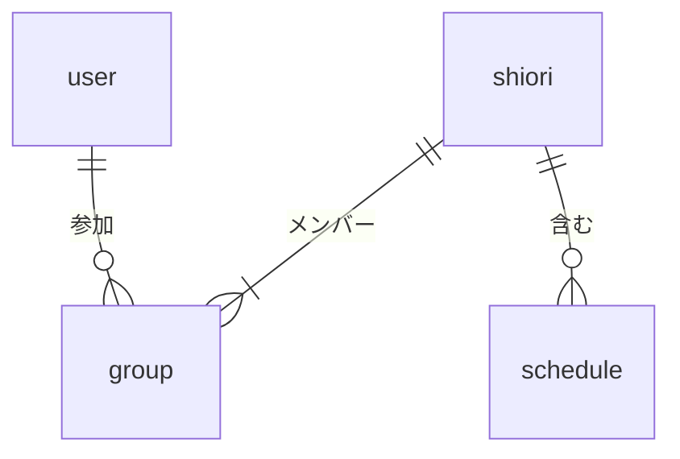

# データ要件

このドキュメントは、Shioriのデータモデルを定義する。各エンティティの構造と属性、およびエンティティ間の関係を記述し、機能要件で定めた動作の裏側にあるデータの形を示す。実装はリレーショナルデータベースを想定するが、特定のDBMSには依存しない記述とする。

すべてのエンティティは識別子（id）、作成日時、更新日時の3つを共通属性として持つ。各エンティティの属性表ではこれらを省略し、ドメイン固有の属性のみを示す。

属性表では、各属性の必須性と論理型を示す。必須性は、生成時に必ず値が必要なものを「必須」、null や未設定を許すものを「任意」と表記する。論理型は実装に依存しない抽象化として記述する（識別子、文字列、整数、数値、日付、時刻、URL、参照、列挙）。

## エンティティ関連図

主要エンティティ間の関係を以下に示す。

しおりは1人以上のメンバー（最低1人は作成者）を持つ。スケジュールはしおりに従属する。スケジュールは外部地図APIまたはPlace APIへの参照を任意で保持できるが、参照先の地点情報そのものは本サービスでは保持しない。地点を持たないスケジュール（移動中の休憩、宿への到着、まだ場所が決まっていないスケジュールなど）も自然に表現できる。

## エンティティ

### ユーザー

サービスを利用する個人を表す。アカウント情報はソーシャルログインのプロバイダ側で管理され、本サービスではプロバイダ識別子と表示用の情報のみを保持する。

| 属性 | 型 | 必須性 | 説明 |
| --- | --- | --- | --- |
| 表示名 | 文字列 | 必須 | 共同編集時に他ユーザーから見える名前 |
| アイコン画像 | URL | 任意 | プロフィール画像のURL |
| 認証プロバイダ | 列挙 | 必須 | apple または google |
| 外部認証ID | 文字列 | 必須 | プロバイダ側で一意なユーザーID |

認証プロバイダと外部認証IDの組み合わせは一意である。同一ユーザーが Apple と Google の両方でログインした場合は、別アカウントとして扱う。アカウント統合機能は持たない。

### しおり

旅行ごとに作成される、本サービスの中心エンティティ。スケジュールとグループを子として束ねる。

| 属性 | 型 | 必須性 | 説明 |
| --- | --- | --- | --- |
| タイトル | 文字列 | 必須 | 旅の名称 |
| 旅行開始日 | 日付 | 必須 | 旅の初日 |
| 旅行終了日 | 日付 | 必須 | 旅の最終日 |
| 表紙画像 | URL | 任意 | しおりカードに表示する画像 |
| 説明文 | 文字列 | 任意 | 旅の概要文 |
| 作成者ユーザー | 参照 | 必須 | ユーザーへの参照 |
| 現行共有トークン | 文字列 | 任意 | 共有リンクの現在有効なトークン |

旅行終了日は旅行開始日と同日以降である必要がある。共有リンク再発行時は現行共有トークンが新しい値に置き換わり、旧トークンによる参加は無効となる。

### グループ

ユーザーとしおりの参加関係を表す。多対多の関係を独立したエンティティとして扱うことで、参加履歴と役割を保持する。

| 属性 | 型 | 必須性 | 説明 |
| --- | --- | --- | --- |
| ユーザー | 参照 | 必須 | ユーザーへの参照 |
| しおり | 参照 | 必須 | しおりへの参照 |
| 役割 | 列挙 | 必須 | creator または member |

ユーザーとしおりの組み合わせは一意である。各しおりは creator の役割を持つグループを正確に1件持つ。参加日時は共通属性の作成日時で代替するため、独立した属性は持たない。

### スケジュール

しおりの中の特定の日付に紐づく単位情報を表す。時刻は開始時刻と終了時刻で表現し、それぞれ任意とする。時刻を持たないスケジュールは時刻情報なしのスケジュールとして扱う。地点が特定されるスケジュールは、外部地図APIまたはPlace APIへの参照を保持する。

| 属性 | 型 | 必須性 | 説明 |
| --- | --- | --- | --- |
| しおり | 参照 | 必須 | 所属するしおり |
| 日付 | 日付 | 必須 | スケジュールの発生日 |
| 開始時刻 | 時刻 | 任意 | スケジュールの開始時刻 |
| 終了時刻 | 時刻 | 任意 | スケジュールの終了時刻 |
| タイトル | 文字列 | 必須 | スケジュールの名称 |
| メモ | 文字列 | 任意 | 自由記述 |
| カテゴリ | 列挙 | 必須 | 観光する・食べる・泊まる・買う・移動・その他 |
| 外部API識別子 | 文字列 | 任意 | 外部地図APIまたはPlace API側で一意な地点ID |
| 作成者ユーザー | 参照 | 必須 | スケジュールを作成したユーザー |

外部API識別子は、スケジュールが地点に紐づく場合にのみ設定される。地点名、地図リンク、緯度、経度、写真などその他の地点関連情報は、本サービスではエンティティとして保持しない。これらは表示時に外部APIから取得する。識別子だけを保持し、他の情報を都度取得する方針は、データの単一情報源を外部APIに集約し、地点情報の更新を本サービス側で追従する必要をなくすことを意図する。

## 共通定義

複数のエンティティで使う列挙型を以下に集める。

### カテゴリ列挙

スケジュールの分類。

| 値 | 表示名 | 用途 |
| --- | --- | --- |
| sightseeing | 観光する | 観光地、名所、アクティビティ |
| eating | 食べる | レストラン、カフェ |
| staying | 泊まる | ホテル、旅館、民泊 |
| shopping | 買う | 土産物店、商業施設 |
| transport | 移動 | 駅、空港、移動の所要時間そのもの |
| other | その他 | 上記のいずれにも当てはまらない |

### 役割列挙

グループが持つ役割。

| 値 | 表示名 | 権限 |
| --- | --- | --- |
| creator | 作成者 | しおりの削除を含むすべての操作 |
| member | メンバー | しおりの編集（削除以外） |

権限の細分化は行わない。creator と member の差は、しおり自体の削除権限の有無に限定する。
