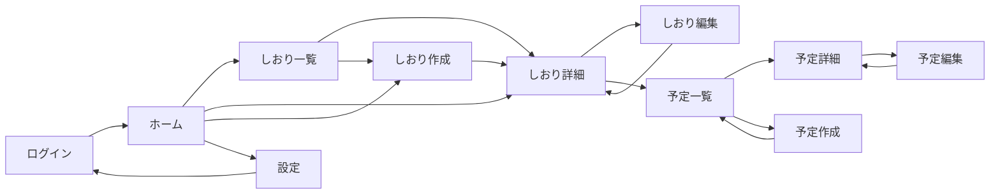

# Shiori 画面要件

## 前提

このドキュメントは、Shioriの画面構成を定義する。各画面について、その画面が果たす役割、出力するデータと値、ユーザーが入力するデータと値、ユーザーが実行できるアクションを記述する。

各画面には画面ID(SC.通し番号)を付与し、機能要件やデータ要件と相互に参照できるようにする。閲覧系の画面と編集系の画面は分けて定義する。閲覧画面で表示できる情報を、編集画面で書き換えるという役割分担を明確にするためである。

ホーム、しおり作成、設定の3つはアプリ内のどの文脈からでも到達できる必要がある。具体的な到達手段はデザインドキュメントで定義する。

## 画面一覧

提供する画面を以下に示す。

| ID | 画面 | 種別 | 役割 |
| --- | --- | --- | --- |
| SC.1 | ログイン | 認証 | 認証エントリーポイント |
| SC.2 | ホーム | 閲覧 | しおりへの復帰と新規作成の起点 |
| SC.3 | しおり一覧 | 閲覧 | 関わるすべてのしおりの俯瞰 |
| SC.4 | しおり詳細 | 閲覧 | 個別しおりの基本情報の確認 |
| SC.5 | しおり作成 | 編集 | 新しいしおりの登録 |
| SC.6 | しおり編集 | 編集 | 既存しおりの基本情報の更新 |
| SC.7 | 予定一覧 | 閲覧 | しおりの特定日の予定群の確認 |
| SC.8 | 予定詳細 | 閲覧 | 個別予定の確認 |
| SC.9 | 予定作成 | 編集 | 新しい予定の登録 |
| SC.10 | 予定編集 | 編集 | 既存予定の更新 |
| SC.11 | 設定 | 編集 | アカウント情報の管理 |

## SC.1 ログイン

未認証ユーザーが最初に到達する認証エントリーポイントである。サービス名と利用可能な認証手段だけを表示し、ユーザーがいずれかを選んでログインを開始する。認証の処理自体は各プロバイダ側で行われ、本画面はその起動点として機能する。

### 出力

画面に出力するのはサービス名と認証手段の選択肢の2つだけである。

- サービス名
- 利用可能な認証手段(Apple、Google)

### 入力

ユーザーから入力するデータはない。

### アクション

実行できるアクションは2つあり、いずれもログインの開始である。

- Apple ログインの開始(成功時は SC.2 ホームへ遷移)
- Google ログインの開始(成功時は SC.2 ホームへ遷移)

## SC.2 ホーム

認証済みユーザーがアプリで最も頻繁に戻ってくる画面で、しおりへの復帰と新規作成の起点となる。情報の網羅性よりも、次の行動への導線を優先する。

### 出力

画面が出力する情報は3種類ある。現在進行中または最も近い未来のしおり、直近で閲覧したしおりのリスト、そして現在のユーザー自身の情報である。しおりに関する情報には共通して、タイトル、旅行開始日と旅行終了日、メンバー数、表紙画像のセットが含まれる。

- 現在進行中または最も近い未来のしおりの基本情報(タイトル、旅行開始日と旅行終了日、メンバー数、表紙画像)
- 直近で閲覧したしおりのリスト(各しおりは同じ基本情報を含む)
- 現在のユーザーの表示名とアイコン画像

### 入力

ユーザーから入力するデータはない。

### アクション

実行できるアクションは4方向の遷移で、いずれもこの画面を起点として別画面へ移る。

- 特定のしおりを指定する(SC.4 しおり詳細へ遷移)
- SC.3 しおり一覧へ遷移する
- SC.5 しおり作成へ遷移する
- SC.11 設定へ遷移する

## SC.3 しおり一覧

ユーザーが作成したしおりおよび参加中のしおりをすべて俯瞰する画面である。

### 出力

出力するのは、自分が関与するすべてのしおりの基本情報と、現在選択中の並び順である。並び順は新着順と更新順の2種類から選べる。

- 自分が関与するすべてのしおりの基本情報(タイトル、旅行開始日と旅行終了日、メンバー数、表紙画像)
- 現在選択中の並び順

### 入力

ユーザーが指定できるのは並び順のみで、新着順か更新順のいずれかを選ぶ。

- 並び順の選択(新着順または更新順)

### アクション

実行できるのは個別しおりへの遷移と、新規作成の起動の2種類である。

- 特定のしおりを指定する(SC.4 しおり詳細へ遷移)
- 新規作成を始める(SC.5 しおり作成へ遷移)

## SC.4 しおり詳細

特定のしおりの基本情報と、その旅の全体像を確認する画面である。日々の予定そのものは別画面で扱い、ここでは旅全体の概観に集中する。

### 出力

出力する情報は、しおりの属性、参加メンバーの構成、各日の予定の概要を含む。参加メンバーは複数のユーザーから成り、各メンバーは表示名とアイコン画像という属性を持つ。各日の予定の概要も同様に複数の日から成り、各日について件数とカテゴリの分布が含まれる。

- しおりのタイトル
- 旅行開始日と旅行終了日
- 表紙画像
- 説明文
- 参加メンバーの一覧。各メンバーについて以下を含む。
  - 表示名
  - アイコン画像
- 各日の予定の概要。各日について以下を含む。
  - 予定件数
  - カテゴリの分布

### 入力

ユーザーから入力するデータはない。

### アクション

実行できるアクションは5つあり、しおりの編集、別画面への遷移、共有リンクの管理、メンバー確認、そして作成者の場合の削除を含む。

- しおりの編集を開始する(SC.6 しおり編集へ遷移)
- 任意の日付を指定する(SC.7 予定一覧へ遷移)
- 共有リンクの発行および再発行
- 参加メンバー一覧の確認
- しおりの削除(作成者のみ実行可能)

## SC.5 しおり作成

新しいしおりを登録するフォーム画面である。

### 出力

画面は入力中のフォームの現在値のみを出力する。

- 入力中のフォームの現在値

### 入力

ユーザーは5つの項目を入力する。このうちタイトル、旅行開始日、旅行終了日の3つは必須で、表紙画像と説明文の2つは任意である。

- タイトル(必須)
- 旅行開始日(必須)
- 旅行終了日(必須)
- 表紙画像(任意)
- 説明文(任意)

### アクション

実行できるアクションは登録と破棄の2つで、いずれも画面を離れる方向のアクションである。

- 入力内容を確定して新規しおりを登録する(成功時は生成されたしおりの SC.4 しおり詳細へ遷移)
- 入力を破棄して前の画面に戻る

## SC.6 しおり編集

既存のしおりの基本情報を更新する画面である。

### 出力

画面は編集対象のしおりの現在の値を出力する。これは編集前の値であり、ユーザーが書き換えなかった項目はこの値のまま維持される。

- 編集対象のしおりの現在のタイトル
- 編集対象のしおりの現在の旅行開始日と旅行終了日
- 編集対象のしおりの現在の表紙画像
- 編集対象のしおりの現在の説明文

### 入力

ユーザーは変更したい項目だけを書き換える。すべての項目が任意となるのは、編集対象の値がすでに存在し、書き換えない項目は元の値を維持するためである。

- 新しいタイトル(任意)
- 新しい旅行開始日(任意)
- 新しい旅行終了日(任意)
- 新しい表紙画像(任意)
- 新しい説明文(任意)

### アクション

実行できるアクションは保存と破棄の2つである。いずれも完了後は閲覧画面に戻る。

- 変更を保存する(成功時は SC.4 しおり詳細へ戻る)
- 変更を破棄して SC.4 しおり詳細へ戻る

## SC.7 予定一覧

しおりの中の特定日の予定群を確認・操作する画面で、日々の旅程を把握するための主要画面である。

### 出力

画面は対象しおりの識別情報、選択中の日付、その日の予定群、そして他の日付への切替先を出力する。予定の一覧の各エントリは、時刻、タイトル、カテゴリといった基本情報に加え、地点情報を持つ場合は地点名と写真も含む。地点情報は任意のため、すべての予定が同じ情報量を持つわけではない。

- 対象しおりのタイトル
- 選択中の日付
- 他の日付の選択肢
- その日に登録されている予定の一覧。各予定について以下を含む。
  - 開始時刻と終了時刻
  - タイトル
  - カテゴリ
  - 地点名(地点情報を持つ場合)
  - 写真(地点情報を持つ場合)
  - メモの有無

### 入力

ユーザーが指定できるのは表示する日付のみで、これにより同じしおりの別の日の予定一覧に切り替えられる。

- 表示する日付の選択

### アクション

実行できるアクションは個別予定の確認、新規予定の作成、そして地図表示への切替の3つである。

- 特定の予定を指定する(SC.8 予定詳細へ遷移)
- 新規予定の作成を始める(SC.9 予定作成へ遷移)
- 地点情報を持つ予定群を地図上での表示に切り替える

## SC.8 予定詳細

特定の予定の詳細情報を確認する画面である。

### 出力

予定の全属性を出力するが、地点情報を持たない予定では地点情報部分が表示されない。地点情報を持つ予定では、地点名、地図リンク、写真の3要素が組として含まれる。

- タイトル
- 日付
- 開始時刻と終了時刻
- カテゴリ
- メモ
- 地点情報(地点情報を持つ場合のみ)。以下を含む。
  - 地点名
  - 地図リンク
  - 写真
- 作成者の表示名

### 入力

ユーザーから入力するデータはない。

### アクション

実行できるアクションは編集の起動、削除、そして地点情報を持つ場合の外部地図アプリへの遷移である。

- 予定の編集を開始する(SC.10 予定編集へ遷移)
- 予定の削除
- 外部地図アプリへ遷移(地点情報を持つ場合のみ)

## SC.9 予定作成

新しい予定を登録するフォーム画面である。

### 出力

画面は作成の文脈情報、入力中のフォームの現在値、そして地点検索を行った場合の検索結果を出力する。

- 作成対象のしおりおよび日付の文脈情報
- 入力中のフォームの現在値
- 地点検索を行った場合の検索結果

### 入力

ユーザーは6項目を入力する。タイトルとカテゴリの2つは必須、開始時刻、終了時刻、メモ、地点情報の4つは任意である。地点情報を入力する場合は、外部API検索から候補を選ぶ流れになる。

- タイトル(必須)
- カテゴリ(必須)
- 開始時刻(任意)
- 終了時刻(任意)
- メモ(任意)
- 地点情報(任意、外部API検索から選択)

### アクション

実行できるアクションは地点検索、登録の確定、入力の破棄の3つである。

- 外部API検索による地点の検索と選択
- 入力内容を確定して新規予定を登録する(成功時は SC.7 予定一覧へ戻る)
- 入力を破棄して戻る

## SC.10 予定編集

既存の予定の情報を更新する画面である。

### 出力

画面は編集対象の予定の現在の全属性を出力する。これは編集前の値であり、ユーザーが書き換えなかった項目はこの値のまま維持される。

- 編集対象の予定の現在のタイトル
- 編集対象の予定の現在の日付
- 編集対象の予定の現在の開始時刻と終了時刻
- 編集対象の予定の現在のカテゴリ
- 編集対象の予定の現在のメモ
- 編集対象の予定の現在の地点情報(地点情報を持つ場合)。以下を含む。
  - 地点名
  - 地図リンク
  - 写真

### 入力

ユーザーは変更したい項目のみを書き換える。地点情報については単に値を書き換えるのではなく、新たな検索による差し替えか、既存の地点情報の解除という2系統の操作がある。

- 新しいタイトル(任意)
- 新しいカテゴリ(任意)
- 新しい開始時刻(任意)
- 新しい終了時刻(任意)
- 新しいメモ(任意)
- 新しい地点情報、または地点情報の解除(任意)

### アクション

実行できるアクションは地点の差し替え、地点情報の解除、変更の保存、変更の破棄の4つである。

- 外部API検索による地点の差し替え
- 既存の地点情報の解除
- 変更を保存する(成功時は SC.8 予定詳細へ戻る)
- 変更を破棄して SC.8 予定詳細へ戻る

## SC.11 設定

アカウント情報を管理する画面である。共有設定はしおりの文脈に紐づくため、ここではなく SC.4 しおり詳細から扱う。

### 出力

画面は現在のユーザー情報を出力する。認証プロバイダの種別は参照のみで、本画面からは変更できない。

- 現在の表示名
- 現在のアイコン画像
- 認証プロバイダの種別

### 入力

ユーザーは変更したい項目のみを書き換える。表示名とアイコン画像のいずれも任意である。

- 新しい表示名(任意)
- 新しいアイコン画像(任意)

### アクション

実行できるアクションはアカウント情報の更新と、ログアウトである。

- 表示名の更新
- アイコン画像の更新
- ログアウト(成功時は SC.1 ログインへ戻る)

## 画面遷移

主要な画面間の遷移を以下に示す。矢印は前方向の遷移を表す。戻る操作はどの画面からも可能で、図には記載しない。

ホームを起点として、しおり一覧、しおり詳細、しおり作成、設定の4方向に分岐する。しおり詳細からはしおり編集と予定一覧へ進める。予定一覧からは予定詳細、予定作成へと進め、予定詳細からは予定編集へと進める。編集系の画面は、対応する閲覧画面へ戻る形で完結する。
